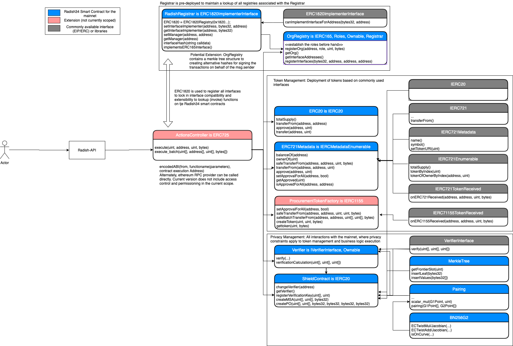
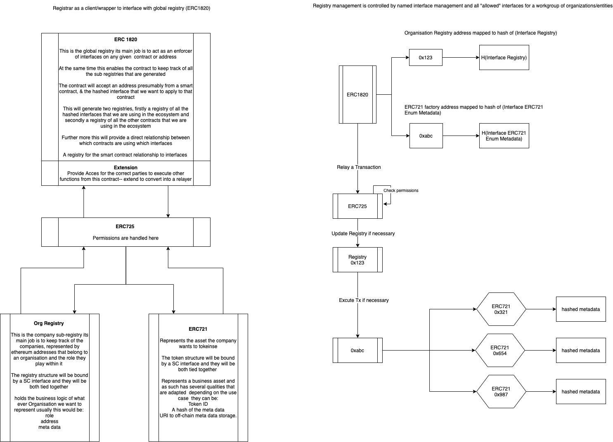

## Table of Contents
- [Overview](#overview)
- [Assumptions](#assumptions)
- [Smart Contract Patterns](#smart-contract-patterns)
- [Deployment Model](#deployment-model)
- [Extensions](#extensions)
- [References](#references)


## Overview

This document is to provide an architectural specification for the Radish34 Procurement solution
using ZKP on the public blockchain. As part of an ongoing iterative development process, 
this document is a working version which will be updated based on feedback, review and use case updates from the stakeholders.
WHen the Radish34 system is initialized, all contracts are deployed and registered with ERC1820Registry
Particularly, for this application, a deployment script is utilized as part of the bootstrap process, to deloy the contracts
and set them ready for interaction during on-going procurement processes. Moreover, in this case the system of smart contracts
is for a given network or workgroup of participants. Depending on the business need, specific interfaces can be defined
and leveraged for a set of participants and by extension any form of global interfaces can be registered/deployed for
different business needs and type/set of participants

## Assumptions:

- Org registry contract is deployed and it stores public identity information for the different parties. OrgRestry is deployed
  as part of the initialization process. However, any number of registries can be created/registered depending on the need.
  This applies to all smart contracts covered under Radish34, that are key for managing the business process - registries,
  tokens, and privacy related contracts
- Onboarding of different parties to the network is assumed to be done (as part of decentralized identity management). 
  To this extent, the additional data used for registering organization can be marked as dataUri or an ENS domain registry
- Buyer’s address can be set in the clear based on understanding of the business implications
- Off-chain data is delivered from one party to another via radish's messenger service, and is always encrypted in-transit. 
  Only a hash of the off-chain data is ever stored on-chain (for integrity)
- During the process of RFP placement, we assume no constraints/adjustments/negotiations on price or quantity
  set during the proposal of the RFQ nor the responses to the RFQ
- Complex and custom business needs related variations such as negotiations, token hierarchies, and additional verifications
  for business logic integrity are left out of scope to leave room for collaborated extensions
- Integration with oracles has been left out of scope as part of the initial implementation

## Smart Contract Patterns:

### List of smart contracts:



The system of smart contracts in Radish34 can be explained in the form of the following higher level patterns or groupings
of the various smart contracts

#### Organization Management

- OrgRegistry

  - Description: Leverages ERC165 and Roles contracts to register organizations
  - Capabilities:
    - Register organizations and maintain an on chain phonebook for organizations, the interfaces used
      and basic identity management pertaining to the needs of the procurement usecase
    - Metadata of the org entity include name, role, ethereum account addresss, messaging key (whisper comm)
      and an additional key to manage private signature verification
    - Other methods such as addRole, removeRole, getRoleType are used as well, and can be handled
      as part of the bootstrap process

#### Token Management

- ERC721(20)

  - Description: Leverages the ERC721, ERC721Metadata, ERC721Enumerable to maintain a registry index
    of ERC721’s along with a factory capability to create new ERC721 tokens.
  - Capabilities:
    - Create ERC20 and ERC721 tokens and manage token transfers
    - Manage private creation, transfer or spend of tokens on chain while maintaining privacy of data/values
      of tokens under zero knowledge

#### Privacy Management

- Verifier

  - Description: Used for onchain verification of zkSnark proofs created offchain using Zokrates
  - Capabilities:
    - On chain verification of proofs using public inputs to provide validation of the proof.
      Events emitted during interaction with Verifier allows for listeners to capture/tag key events and triggers
    - All verifications on chain can be registered using registerVerfication method
    - Uses pairing friendly elliptic curve BN256G2 which is pre-compiled on the EVM to enable on chain verification

- Shield

  - Description: Uses a merkle tree structure for storing cryptographic commitments
  - Capabilities:
    - Ability to mint token or document commitments (PO or MSA, as examples) to compute the hashing
      on chain (using a SHA256 variation)
    - By interaction with the Verifier and requiring the on chain verification of a proof, any business
      process or action can be verified on chain before storing a hashed representation of such an action
      in the Merkle tree

## Deployment Model:



- Registrar

  - Description: Leverages EIP 1820 (GlobalRegistrar) for registering multiple interfaces
    (registries/factories for ERC721 tokens, organizations, Shield Contracts, and Verifier). To
    avoid coupling with all the registries, the ERC1820 can be instantiated within the
    Registrar
    `(ERC1820Registry constant ERC1820REGISTRY = ERC1820Registry(0x1820a4B7618BdE71Dce8cdc73aAB6C95905faD24);`
    Registrar acts as a client to the global registry (ERC1820Registry) and enables a lookup/control facility 
  - Capabilities:
    - setInterfaceImplementer: Sets the interface for:
      - a given address (an Ethereum account or smart contract; in this case it is the sender’s
        account address for organization registry; and organization registry address for all other
        registries)
      - name of the interface
      - address of the deployed contract
    - getInterfaceImplementer: Gets the interface for:
      - a given address (an Ethereum account or smart contract; in this case it is the sender’s
        account address for organization registry; and organization registry address for all other
        registries)
      - name of the interface
    - setManager: Sets the manager by taking the existing and new addresses. Note that if ERC725 is
      leveraged, accordingly the proxy contract is to be made the manager to be able to execute
      methods on registries
    - interfaceHash: Computes the interface hash for the interface name

- Example deployment: Below is an example of the deployment of `OrgRegistry.sol`. 
    - `Registrar(_erc1820)` indicates the inheritance pattern using Registrar. On the main net, 
       there wouldn't be a need to leverage a custom deployment of `erc1820` as there is an existing ERC1820 address on the mainnet, 
       which can be substituted below with `0x1820a4B7618BdE71Dce8cdc73aAB6C95905faD24`
    - Note that this is a constructor of the OrgRegistry contract which self registers an interface name `IOrgRegistry`.
      In a similar manner, other key interfaces for tokens, shield contracts and verifier contracts in Radish34 smart contract system

```Javascript
    constructor(address _erc1820) public Ownable() ERC165Compatible() Registrar(_erc1820) {
        setInterfaces();
        setInterfaceImplementation("IOrgRegistry", address(this));
    }
```

## Extensions:

### Smart Contract Extensions:

- ActionsController

  - Description: Leverages ERC725 to execute transactions on behalf of another Ethereum address
    (account or contract)
  - Potential Capabilities:
    - Execute: Executes an action on other contracts or a transfer of the blockchains native
      cryptocurrency. MUST only be called by the current owner of the contract (inspired by ERC1077
      and Gnosis)
    - Execute_batch: Executes a batch set of transactions to be deployed on a target contract
      address

- ProcurementTokenFactory
  - Description: Leverage other standards like the ERC1155 Multi-token standard to extend abilities
    to deploy multiple fungible and non-fungible tokens
  - Potential Capabilities:
     - Ability to extend the funactionality of batch execution in ActionsController by 
       maintaining a link to the ActionsController
     - Further capabilities include abilities to relaease tokens for integration with existing main net
       wallets and DeFi provisions, within the constraints of privacy
     - Extensions to shield and verifier contracts as a factory deployment model

- OrgRegistry
  - Description: Leverage other identity token standards such as element and collaborative development toward
    decentralized identity management
  - Potential Capabilities:
     - Enhance org registry to include ENS or any other domain registries for the corporate identity of organizations
     - Enhancements toward org registry as a corporate wallet extension
     - Integrations with relay contracts for executing meta transactions, while also leveraging ActionsConteoller

- Shield Contract
  - Description: Leverage other optimizations of the managing cryptographic commitments for better performance and
    lower gas consumption
  - Potential Capabilities:
     - Optimizations to merkle tree structures and extensions to identity management to hide the identity of the
       parties in interaction
     - Other form of data structures such as accumulators, sparse merkle trees, etc.
     - Associated extensions to verifier contracts for on chain verification other under EC's and pairing libraries
     - Extensions to shield and verifier contracts as a factory pattern to generate contracts from contracts,
       which could include other hashing mechanisms such as Pedersen, Mimc, etc.

## References:
- [EIP1820Registry](https://eips.ethereum.org/EIPS/eip-1820)
- [ERC1155 Multi Token Standard](https://eips.ethereum.org/EIPS/eip-1155)
- [Zokrates Verifier Contract](https://github.com/Zokrates/ZoKrates/blob/585fc01020a6ca51949403ae095f03477f76ab9f/zokrates_book/src/reference/cli.md)
